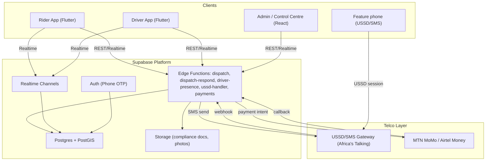
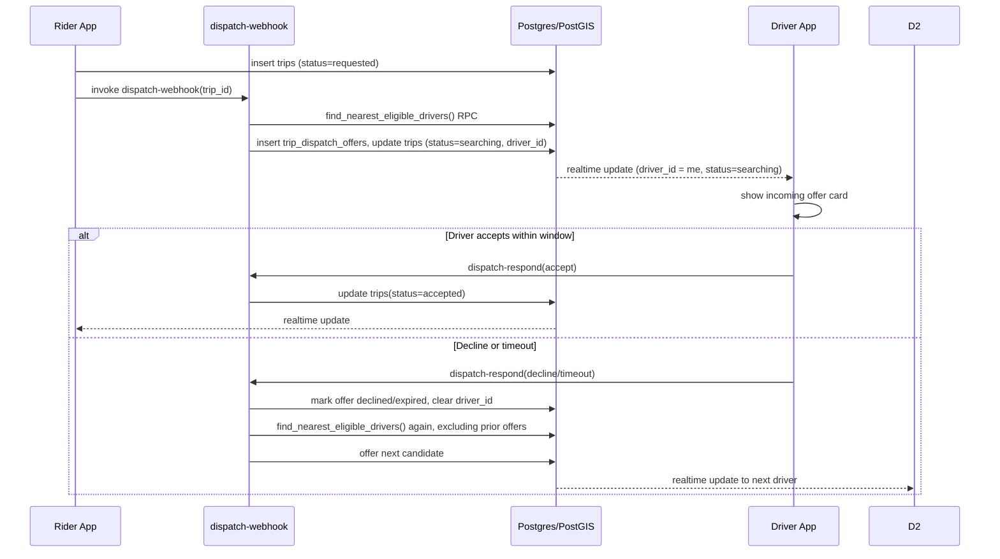
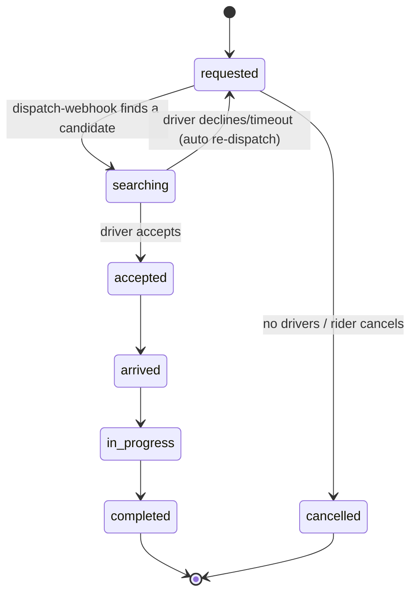

# Technical Requirements Document (TRD)

Companion to 01_PRD.md. This document describes how Pikipiki Arua is built: architecture, stack, integration points, and the specific technical decisions that keep the door open to a super app expansion without a rewrite.

---

## 1. System Overview

Pikipiki Arua is a three sided platform connecting riders and boda boda drivers in Arua, Uganda, with a control centre/admin layer for safety and operations oversight. The defining constraint is that Arua is a low and intermittent connectivity, feature phone mixed, cash and mobile money market: the system is offline first and degrades gracefully to USSD/SMS rather than failing when data drops.

The platform has four components today, with a fifth reserved for later:

1. **Rider app** (Android first, Flutter): booking, fare transparency, safety verification, payment.
2. **Driver app** (Android first, Flutter): compliance gating, dispatch, navigation by landmark, earnings.
3. **Degraded channel** (USSD and SMS): a parallel, always available path covering booking, fare confirmation, driver verification, and SOS.
4. **Backend platform**: API, matching/dispatch engine, geospatial services, payments orchestration, notification/SMS/USSD gateway integration, and an admin/control centre web console.
5. **(Reserved, not built) Service module layer**: a thin extension point, described in section 8, that lets a second and third vertical (delivery, errands, bill pay) attach to the same identity, wallet, and app shell.

## 2. Technical Stack

### 2.1 Client applications
- **Framework:** Flutter, single codebase, Android first (iOS retained for later expansion).
- **State management:** Riverpod.
- **Local persistence / offline cache:** `drift` (SQLite) for structured offline data (saved landmarks, trip history, compliance cache, outbound action queue), plus `flutter_secure_storage` for auth tokens.
- **Maps:** Offline capable vector maps via a self hosted, pre clipped OpenStreetMap extract for Arua, avoiding per tile billing and live tile data cost. A commercial maps fallback is a later expansion item.
- **Push notifications:** Firebase Cloud Messaging, with SMS as the guaranteed fallback channel for anything safety critical.

### 2.2 Backend platform
- **Primary backend:** Supabase (managed Postgres, Auth, Realtime, Storage, Edge Functions). Chosen to minimise new operational surface area for a small team.
- **Geospatial:** PostGIS for nearest driver queries, zone/geofence lookups, and route distance estimation.
- **Real time:** Supabase Realtime channels for live position broadcast and dispatch status, scoped per trip and torn down on completion to bound connection count.
- **Business logic / API:** Supabase Edge Functions (Deno/TypeScript), kept stateless and independently deployable per function. Current functions: `dispatch-webhook` (initial matching), `dispatch-respond` (accept/decline/timeout with automatic re offer), `driver-presence` (online status and location), `ussd-handler` (USSD menu), `product-image` (media handling).
- **Auth:** Supabase Auth with a phone/OTP provider.

### 2.3 Telco integrations (Uganda specific)
- **USSD and SMS gateway:** Africa's Talking as the primary aggregator, abstracted behind an internal gateway interface so a second aggregator can be added for redundancy.
- **Mobile money:** MTN MoMo Open API and Airtel Money Open API, either integrated directly or via a payment service provider (for example Flutterwave or DPO/Pesapal) to reduce direct integration and compliance overhead for v1, with a path to direct integration once volume justifies it.

### 2.4 Admin console
- **Framework:** React and TypeScript (Vite), Tailwind CSS, deployed as a static app against the same Supabase backend, gated by an `admin`/`dispatcher` role via row level security.
- **Live map:** A JS map library subscribed to the same Realtime channels as the mobile apps.

### 2.5 Infrastructure and environments
- **Hosting:** Supabase Cloud, region selected for lowest latency to Uganda currently available.
- **CI/CD:** GitHub Actions: Flutter build/test/lint on pull request, store deploys on merge to `main`, Supabase CLI migrations applied via a gated pipeline.
- **Environments:** `dev`, `staging`, `production` Supabase projects, kept schema identical via versioned migrations. USSD/SMS gateway sandbox credentials used outside production.

## 3. Architecture Diagram

## 4. Key Sequence: Trip Request to Match (as implemented)

## 5. Data Flow and State Management

### 5.1 Trip state machine

### 5.2 Client side state
- Riverpod separates server state (trip, driver location, fare, sourced from Supabase Realtime/REST) from local/offline state (saved landmarks, cached maps, outbound action queue, sourced from `drift`).
- An outbound sync queue records every mutating action taken while offline; a background worker drains it on reconnect using idempotency keys, so a retried sync never double applies.

### 5.3 Backend dispatch flow
1. Rider submits a trip request; fare is pre computed client side for display and re validated server side.
2. `dispatch-webhook` writes/updates the trip and runs the matching RPC.
3. The RPC ranks online, verified drivers by distance within a radius, excluding anyone already offered this trip.
4. The nearest candidate is offered; a client side countdown enforces the accept window; on timeout or decline, `dispatch-respond` immediately re offers to the next candidate.
5. On accept, both parties subscribe to the trip's Realtime channel.
6. Trip completion triggers fare finalisation, payment intent creation, and commission ledger accrual.

### 5.4 Degraded channel flow
- Inbound USSD requests hit a stateless webhook per aggregator session; session state is persisted server side (JSONB), not in memory, since USSD sessions span multiple HTTP round trips.
- Outbound driver assignment and SOS content is generated by the same fare/matching services as the app path. There is exactly one source of truth for fare and matching logic.

## 6. Non-Functional / Technical Requirements

See PRD.md section 8 for the full table. Technical implications worth calling out here:

- **SOS independence:** implemented as a directly callable function with its own retry logic straight to the SMS gateway, never routed through the general dispatch pipeline.
- **USSD session limits:** telco sessions typically time out in 15 to 30 seconds per screen; all USSD logic responds well within that, with server side session state.
- **Idempotent retries:** client networking uses short timeouts, exponential backoff, and client generated idempotency keys, since the harder failure mode is a flaky connection, not a fully offline one.
- **Aggregator abstraction:** both the USSD/SMS gateway and the mobile money integration are wrapped behind an internal interface from day one, so a vendor outage or commercial dispute does not become a platform wide outage.

## 7. Security

- OTP based auth only, no stored passwords.
- Row Level Security on every table; service role keys are used only inside Edge Functions, never shipped inside a client bundle.
- Payment callbacks are verified via provider signatures before being trusted.
- PII (phone numbers, national ID uploads) is encrypted at rest and access limited by role.
- Every fare, compliance, or payment state change is logged with actor, timestamp, and before/after values (an audit trail, not just a mutable current state).
- Data retention limits for location history, USSD session logs, and ID documents are defined and enforced by a scheduled job, in line with Uganda's Data Protection and Privacy Act (2019).

## 8. Super App Extensibility: Technical Design

This section is the technical counterpart to PRD.md section 9. It describes how the current, already implemented schema and services can grow into additional verticals without a rewrite. Nothing here is built yet; it constrains how Phase 1 code is written.

### 8.1 Approach: modular monolith first, extract later

Pikipiki Arua stays a single Supabase project and a small set of Edge Functions for as long as that remains operationally simple (this is deliberate: a small team should not run a microservices fleet before it has the load or the headcount to justify it). Extensibility comes from how the **data model** and the **app shell** are structured, not from premature service splitting. If a future vertical (for example delivery) grows large enough to need its own scaling profile, its Edge Functions and tables can be lifted into a separate Supabase project or service behind the same API gateway pattern, because they were already modeled as a distinct, loosely coupled module.

### 8.2 The order abstraction

Instead of a `trips` table that only ever means "a ride," the target model (see BACKEND_SCHEMA.md section 3) is:

- `orders`: the generic transaction, with an `order_type` column (`ride` today, `delivery`/`errand` later), a status shared across types, and a `metadata` JSONB column for type specific fields that do not warrant their own column.
- `ride_details`: a 1:1 extension table holding the fields specific to a ride (pickup/dropoff stage, helmet check, route).
- A future `delivery_details` table would follow the same pattern.

This means matching, payment, rating, and notification logic can all operate against `orders` generically, and only the parts that truly differ per vertical (what does the request form look like, what does "in progress" mean) live in the extension tables.

The already built `trips` table is not being replaced today. BACKEND_SCHEMA.md documents the exact evolutionary migration: `trips` becomes the `ride_details` extension table once a generic `orders` table is introduced, with a compatibility view so existing app code keeps working during the transition.

### 8.3 The identity and wallet model

- One `profiles` row per person. `role` becomes a many valued capability set (`rider`, `driver`, later `courier`, `vendor`) rather than a single exclusive value, so a person is not forced into a second account to use a second service.
- One `wallets` row per person with one running balance, and a `wallet_transactions` ledger tagged by `purpose` (`ride_fare`, `commission`, later `delivery_fee`, `bill_payment`). Reporting and reconciliation queries filter by purpose; they do not require a second ledger system per vertical.

### 8.4 The provider/agent model

A `drivers` row today is a specific case of a more general "the person who fulfils this order type" concept. When a second fulfilment role appears, it is modeled the same way `drivers` is modeled now (its own compliance table, its own eligibility flag, its own location stream), rather than overloading the `drivers` table with unrelated columns.

### 8.5 App shell and configuration

- The rider app's navigation is built so that adding a second primary action (a second service tile on the home screen) is a UI change, not an architecture change: the home screen already reads its available actions from a small, app side list rather than hardcoding a single screen as the entire app.
- Feature availability (which modules are visible to which users, in which region) is intended to be driven by a server side configuration/feature flag mechanism once a second module exists, not a compiled in constant. Phase 1 does not need to build this mechanism yet since there is only one module, but Phase 1 code should not make assumptions that actively prevent it (for example, hardcoding "there is exactly one thing a user can request" deep in shared navigation code).

### 8.6 What this means for Phase 1 engineering, concretely

- Name tables and columns generically where it costs nothing to do so now (`orders` conceptually, even if only `ride` exists; `wallet_transactions.purpose` even if only one purpose exists today), documented in BACKEND_SCHEMA.md.
- Do not couple matching, payment, or notification Edge Functions to ride specific field names where a generic name would do.
- Do not build the module registry, multi vertical admin UI, or a second vertical now. That is explicitly deferred to Phase 2 per PRD.md section 4.2, and is sequenced in IMPLEMENTATION_PLAN.md.

## 9. Deployment and Environments

- `dev` -> `staging` -> `production` Supabase projects, schema kept identical via versioned migrations checked into the repository.
- Migrations are reviewed like code; RLS policy changes require explicit reviewer sign off given their security sensitivity.
- Feature flags (payment method availability, SOS variant, USSD menu structure) are server configurable, not hardcoded in the client build, so field learnings apply without an app store release cycle.
- Regular in field test sessions on real, low end Android devices over real Arua network conditions, starting at the first milestone that produces a demoable rider/driver loop, not only before launch.

## 10. Related Documents

- 01_PRD.md for product scope and requirements.
- 03_BACKEND_SCHEMA.md for the full current and target data model.
- 04_IMPLEMENTATION_PLAN.md for phased delivery.
- 05_APP_FLOW.md for screen level flows.
- 06_UI_UX_DESIGN.md for the visual design system and its application.
