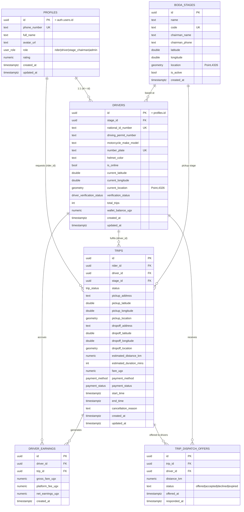

# Backend Schema

Companion to 02_TRD.md section 8. This document has three parts: the schema exactly as implemented today, the target schema designed for super app growth, and the migration path between them. Nothing in part 2 is built yet; it is a design target to steer Phase 1 decisions, per IMPLEMENTATION_PLAN.md.

All tables live in Postgres (Supabase) with the PostGIS extension enabled. Primary keys are UUIDs unless noted.

---

## 1. Schema As Implemented Today (Phase 1, current)



### 1.1 Enums in use
- `user_role`: `rider`, `driver`, `stage_chairman`, `admin`
- `trip_status`: `requested`, `searching`, `accepted`, `arrived`, `in_progress`, `completed`, `cancelled`
- `payment_method`: `cash`, `mtn_momo`, `airtel_money`
- `payment_status`: `pending`, `processing`, `completed`, `failed`
- `driver_verification_status`: `pending`, `verified`, `rejected`, `suspended`

### 1.2 Matching engine additions
- `find_nearest_eligible_drivers(p_pickup_lat, p_pickup_lng, p_radius_km, p_exclude_driver_ids, p_limit)`: a PostGIS RPC ranking online, verified drivers by distance within a radius, excluding drivers already offered a given trip.
- `trip_dispatch_offers` is the audit trail the matching engine reads to know who has already been tried on a given trip, so a decline moves to the next nearest candidate rather than re-offering the same driver.
- Realtime is enabled on `public.trips` so both apps can subscribe to live status/driver_id changes.

### 1.3 Row Level Security summary
- `profiles`: publicly readable; a user can update only their own row.
- `boda_stages`: publicly readable.
- `drivers`: publicly readable (so a matched driver's public profile can be shown to a rider); a driver can update only their own row.
- `trips`: readable and updatable only by the rider or the assigned driver on that trip.
- `trip_dispatch_offers`: readable by the offered driver or the trip's rider; all writes go through Edge Functions using the service role key, which bypasses RLS, keeping the matching engine as the single writer.
- All authoritative dispatch writes (`dispatch-webhook`, `dispatch-respond`, `driver-presence`) go through the service role key rather than direct client writes, since the driver app does not yet have a real Supabase Auth session (see TRD.md and IMPLEMENTATION_PLAN.md for closing this gap).

---

## 2. Target Schema for Super App Growth (design target, not yet built)

The tables below are additive and evolutionary, not a replacement. The goal is one identity, one wallet, and one generic transaction shape that a second vertical can plug into later.

```mermaid
erDiagram
    PROFILES ||--o{ WALLETS : "1:1"
    WALLETS ||--o{ WALLET_TRANSACTIONS : records
    PROFILES ||--o{ SERVICE_PROVIDERS : "1:1 per provider type"
    SERVICE_PROVIDERS ||--o{ PROVIDER_COMPLIANCE : has
    PROFILES ||--o{ ORDERS : places
    SERVICE_PROVIDERS ||--o{ ORDERS : fulfils
    ORDERS ||--|| RIDE_DETAILS : "order_type = ride"
    ORDERS ||--o| DELIVERY_DETAILS : "order_type = delivery (future)"
    ORDERS ||--o{ ORDER_EVENTS : logs
    ORDERS ||--o{ WALLET_TRANSACTIONS : "settled_by"
    ORDERS ||--o{ RATINGS : rated_by
    SERVICE_MODULES ||--o{ ORDERS : "order_type belongs to"

    WALLETS {
        uuid id PK
        uuid profile_id FK UK
        numeric balance_ugx
        timestamptz updated_at
    }
    WALLET_TRANSACTIONS {
        uuid id PK
        uuid wallet_id FK
        uuid order_id FK "nullable"
        text purpose "ride_fare|commission|delivery_fee|bill_payment|topup|withdrawal"
        text direction "credit|debit"
        numeric amount_ugx
        text method "cash|mtn_momo|airtel_money|internal"
        text status "pending|completed|failed"
        text provider_reference
        timestamptz created_at
    }
    SERVICE_MODULES {
        text key PK "ride|delivery|errand|bill_pay"
        text display_name
        bool is_enabled
        jsonb config
    }
    SERVICE_PROVIDERS {
        uuid id PK "= profiles.id"
        text provider_type "boda_driver|courier|vendor"
        bool is_online
        bool is_eligible
        geometry current_location
        timestamptz last_seen_at
    }
    PROVIDER_COMPLIANCE {
        uuid id PK
        uuid provider_id FK
        text check_type
        text status
        date expires_at
    }
    ORDERS {
        uuid id PK
        text order_type "ride|delivery|errand"
        uuid customer_id FK "profiles.id"
        uuid provider_id FK "service_providers.id, nullable"
        text status "shared lifecycle across order types"
        text channel "app|ussd|sms"
        numeric total_amount_ugx
        jsonb metadata "type-specific extras that do not need their own column"
        timestamptz requested_at
        timestamptz completed_at
    }
    RIDE_DETAILS {
        uuid order_id PK FK
        uuid pickup_stage_id FK
        geometry pickup_location
        geometry dropoff_location
        numeric distance_km
        bool helmet_check_passed
    }
    DELIVERY_DETAILS {
        uuid order_id PK FK
        geometry pickup_location
        geometry dropoff_location
        text parcel_size
        text recipient_phone
    }
    ORDER_EVENTS {
        uuid id PK
        uuid order_id FK
        text event_type
        jsonb payload
        timestamptz created_at
    }
    RATINGS {
        uuid id PK
        uuid order_id FK
        int stars
        text comment
    }
```

### 2.1 Design notes

- **`orders` is the generic spine.** Matching, payment settlement, rating, and notifications operate against `orders` and `order_type`, not against a ride specific table. Only the fields that genuinely differ per vertical live in a `*_details` extension table (`ride_details` today, `delivery_details` when that vertical is built).
- **`wallets` and `wallet_transactions` are the one and only ledger.** A ride fare, a future delivery fee, and a future bill payment are all rows in `wallet_transactions`, distinguished by `purpose`, not separate ledgers. This is what makes "one balance across every service" possible later without a data migration.
- **`service_providers` generalises `drivers`.** A boda driver is `provider_type = 'boda_driver'`. A future courier would be `provider_type = 'courier'` on the same table, the same compliance pattern, and the same payout rails, rather than a parallel, disconnected system.
- **`service_modules` is the on/off switch.** Before a second vertical exists this table can hold a single `ride` row with `is_enabled = true`. It exists so that turning on a second vertical, or turning one off in a specific region, is a data change, not a deploy.
- **Nothing here removes PostGIS, RLS, or the audit trail approach already in place.** Geometry columns, row level security patterns, and an events/audit table are carried forward unchanged in shape from part 1.

### 2.2 Migration path from the current schema (evolutionary, not a rewrite)

This is the intended sequence, to be executed only when Phase 2 actually starts, not now:

1. Introduce `wallets` and `wallet_transactions`. Backfill one wallet per existing profile; migrate `drivers.wallet_balance_ugx` and `driver_earnings` rows into wallet transactions tagged `purpose = 'commission'`. Keep `drivers.wallet_balance_ugx` as a read only, trigger maintained mirror during a transition window so no existing UI breaks.
2. Introduce `orders` and `ride_details`. `ride_details` takes over the columns that are genuinely ride specific from `trips` (pickup/dropoff geometry, helmet check). A database view named `trips` is created over `orders` joined to `ride_details`, matching the exact current `trips` shape, so existing application queries keep working unchanged during the transition.
3. Introduce `service_providers` and `provider_compliance` as a generalisation of `drivers`. A compatibility view named `drivers` is created the same way.
4. Only once the app layer has been moved onto the generic tables (or the compatibility views have been in place, proven stable, and the client code has been updated at a comfortable pace) are the compatibility views retired and the original `trips`/`drivers` tables dropped.
5. Add `service_modules` and a second `order_type` (for example `delivery`) only when that vertical is actually being built, per PRD.md section 4.2.

This keeps Phase 1 shipping against the schema in part 1 exactly as it is today, while guaranteeing that Phase 2 is additive, view backed, and reversible at every step, rather than a breaking rewrite.

## 3. Related Documents

- 02_TRD.md section 8 for the architectural reasoning behind this design.
- 01_PRD.md section 9 for the product level extensibility requirements this schema satisfies.
- 04_IMPLEMENTATION_PLAN.md for when each migration step above is actually scheduled.
