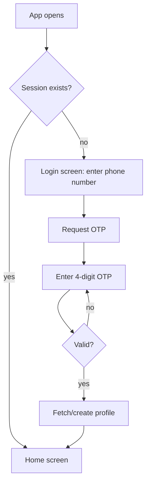
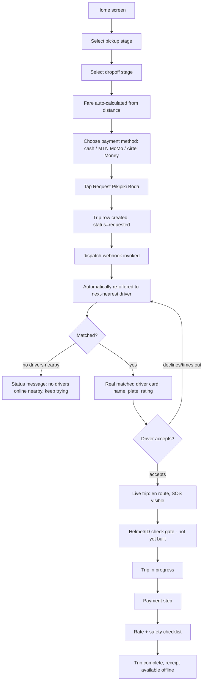
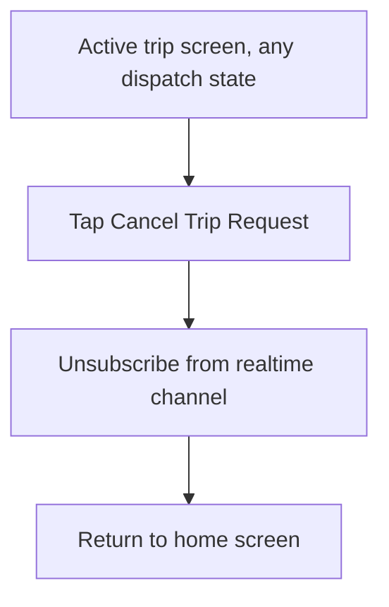
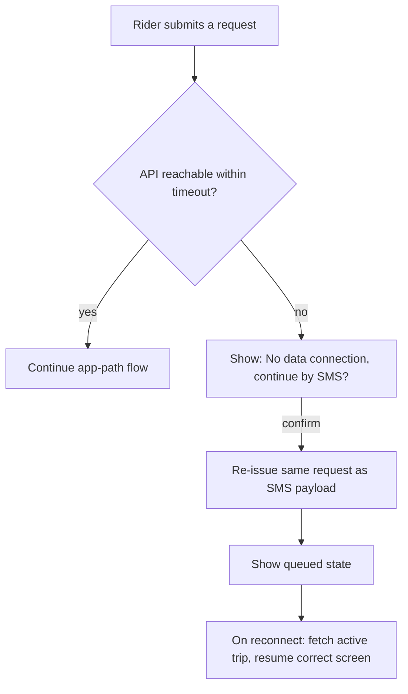
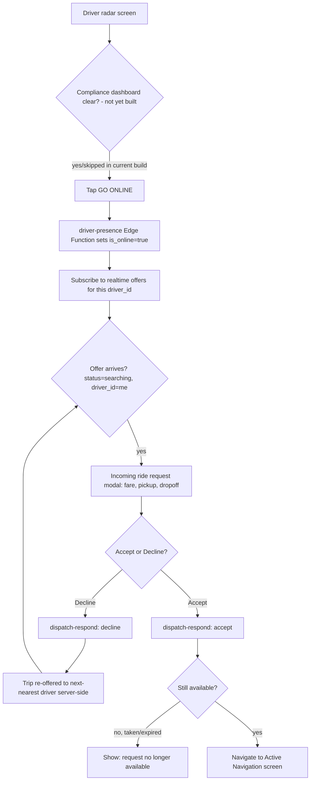
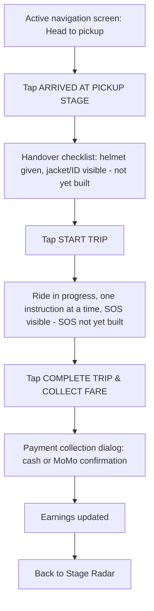
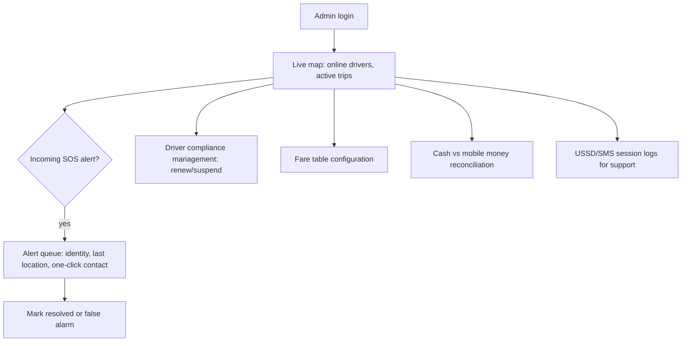
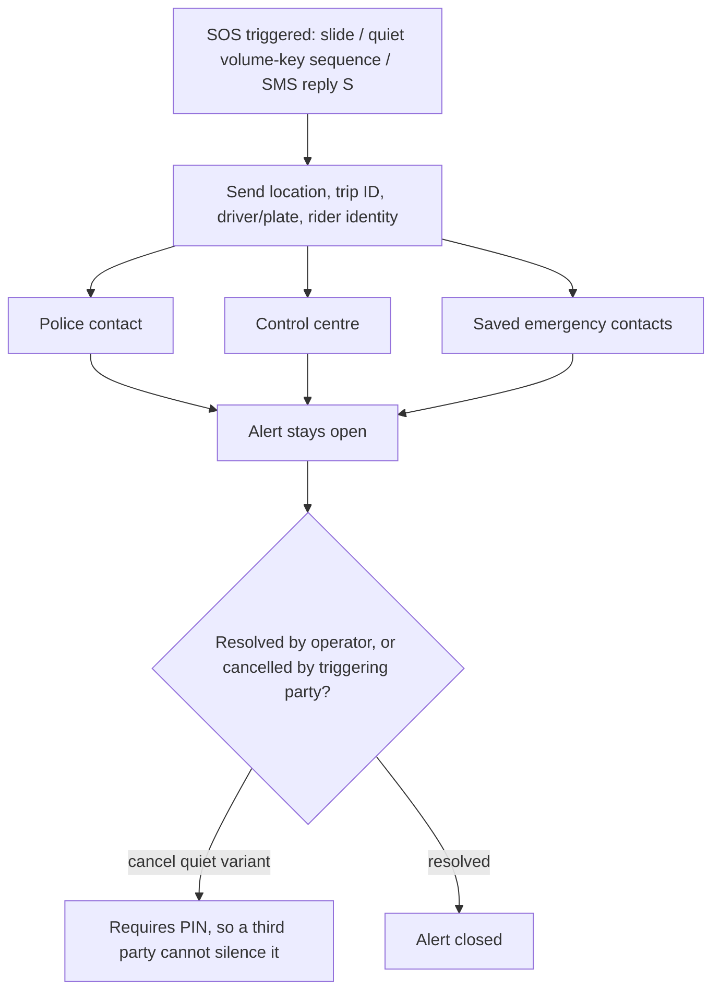
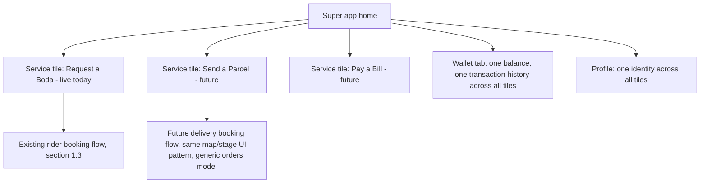

# App Flow

Companion to 01_PRD.md section 7 and 06_UI_UX_DESIGN.md. Screen level flows for the rider app, the driver app, the admin console, and a conceptual future super app home screen. Each flow references the actual screen files in the codebase where they already exist.

---

## 1. Rider App Flow

### 1.1 Screen map (current)
- `login_screen` (phone entry, OTP entry)
- `home_screen` (map, pickup/dropoff stage selectors, fare, payment method, request button)
- `active_trip_screen` (dispatch status, matched driver card, route, cancel)
- `profile_screen`

### 1.2 Onboarding and login

### 1.3 Booking and dispatch (as implemented)

### 1.4 Cancellation

### 1.5 Connectivity loss mid-flow (per PRD.md section 7, not yet built)

## 2. Driver App Flow

### 2.1 Screen map (current)
- `driver_login_screen` (demo identity today; real phone OTP planned)
- `driver_radar_screen` (online/offline toggle, incoming offer modal)
- `active_navigation_screen` (pickup navigation, handover, trip lifecycle, payment collection)
- `earnings_screen`, `driver_profile_screen`

### 2.2 Going online and receiving a real offer (as implemented)

### 2.3 Trip lifecycle (post-accept)

## 3. Admin / Control Centre Flow (planned, not yet built)

## 4. Emergency / SOS Flow (planned, not yet built)

## 5. Future: Super App Home Screen Concept (design reference only, not being built now)

This is included so current navigation code is not built in a way that forecloses it later, per PRD.md section 9 and TRD.md section 8.5. It is not a Phase 1 deliverable.

The point of this diagram is narrow: the home screen's service list should already be data driven (see UI_UX_DESIGN.md section 6) so that adding `S2` later is adding a row to a list, not restructuring the app.

## 6. Related Documents

- 01_PRD.md section 7 for the narrative version of these flows.
- 06_UI_UX_DESIGN.md for the visual treatment of each screen referenced here.
- 02_TRD.md section 4 for the backend sequence diagram behind section 1.3/2.2 above.
